# GoGo CodeLens

A VS Code extension that adds CodeLens annotations to your Go code. showing reference counts, interface implementations, and method relationships inline.

## What's new


- Added [type alias](#type-alias-configuration---references), [constant](#constant-configuration---references) and [variable](#variable-configuration---references) codelens
- Added an [option](#caching-strategy) to choose the caching strategy.

See full changelog here https://github.com/XiaoXuxxxx/gogo-codelens/blob/main/CHANGELOG.md

##  Features

- Show reference count or implement count above function, interface, interface method, method, struct, type alias, constant, variable in Go code
- Fully customizable — You can [enable/disable](#configuration) each annotation type and change how the codelens should be displayed

|            |                                                                 |
|------------|-----------------------------------------------------------------|
| Interface  | 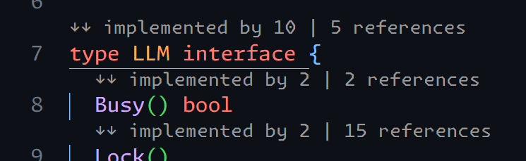 |
| Method     | 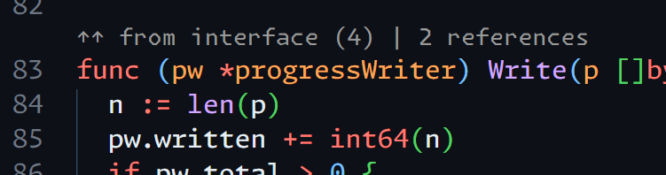                     |
| Function   | 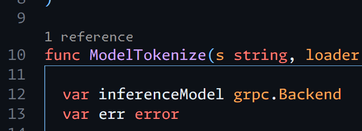                 |
| Struct     | 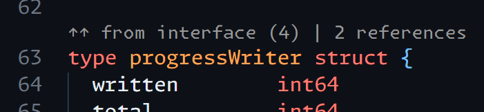                     |
| Type alias | 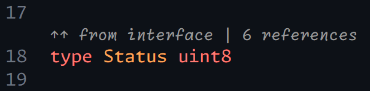             |
| Variable   | 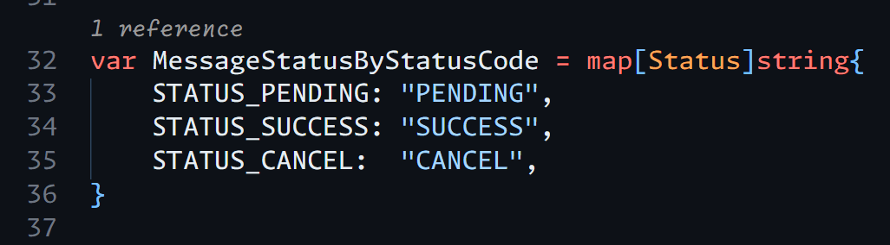                 |
| Constant   |                  |

> Don't worry, all annotations are fully [customizable](#configuration) and can be turned off if you prefer a cleaner view.


## Installation

### Option 1: Install from VS Code Marketplace

You can download it from https://marketplace.visualstudio.com/items?itemName=xiaoxuxxxx.gogo-codelens

### Option 2: Build and Install Locally

In case you don't trust my provided bundle vsix file (you should not trust any unknown extension in marketplace). Here's step to build

#### Prerequisite

- [NodeJS](https://nodejs.org/en)
- [vsce](https://github.com/microsoft/vscode-vsce)

#### Build extension file

1. install the dependencies

```sh
npm i 
```

2. run build command

```sh
vsce package
```

and your `.vsix` file will be generated in workspace directory

#### Install from locally build file

1. From your VS Code, go to extension tab

2. Click `...` and then click `Install From VSIX`

3. Select builded file

> Tips: You can just drag and drop the `.vsix` file to the Extension tab to install it

## Configuration

You can configure the extension in your VS Code `settings.json` or through the settings UI.

### Caching Strategy

| Setting | Description | Default |
|---------|-------------|---------|
| `gogoCodeLens.codelens.cacheStrategy` | Define the caching strategy when generating the codelens | `VERSION_AND_TIMESTAMP` |

| Possible Value | Description |
|---------|-------------|
| `VERSION_AND_TIMESTAMP` | Caches results based on the document version and the last updated dattime of all documents |
| `NO_CACHE` | Disables caching, forcing recalculation every time the file is switched or edited.  |

> If you notice that the CodeLens is not updating correctly or behaves inconsistently, it may be due to caching issues. To resolve this, consider using `NO_CACHE`

### Main switch configuration

| Setting | Description | Default |
|---------|-------------|---------|
| `gogoCodeLens.codelens.enabled.showReferences` | Enable CodeLens annotations for all supported symbols to show how many times they are referenced. | `true` | 
| `gogoCodeLens.codelens.enabled.showImplementations` | Enable CodeLens annotations for all supported symbols to show their implementations. | `true` | 

### Function Configuration - `references`


| Enable Only `references`|
|---------|
||


| Setting | Description | Default |
|---------|-------------|---------|
| `gogoCodeLens.codelens.function.references.isEnabled` | Enable CodeLens annotations above functions to show how many times they are referenced. | `true` | 
| `gogoCodeLens.codelens.function.references.singularTemplate` | Template text displayed above a function with exactly one reference. | `{{ count }} reference` |
| `gogoCodeLens.codelens.function.references.pluralTemplate` | Template text displayed above a function with multiple references. | `{{ count }} references` |
| `gogoCodeLens.codelens.function.references.emptyText` | Text displayed above a function when no references are found. Leave empty to disable the annotation. | *(empty — hides CodeLens)* |


### Interface Configuration - `references`

| Enable Only `references` | Enable Both `implementBy` and `references` |
|---------|-------------|
|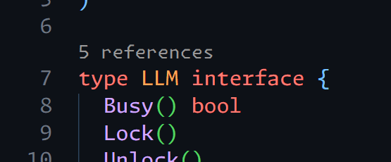|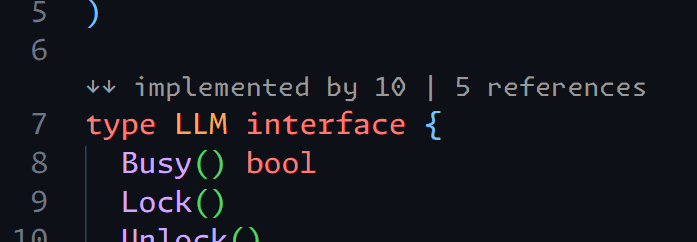|


| Setting | Description | Default |
|---------|-------------|---------|
| `gogoCodeLens.codelens.interface.references.isEnabled` | Enable CodeLens annotations above interfaces to show how many times they are referenced. | `true` |
| `gogoCodeLens.codelens.interface.references.singularTemplate` | Template text displayed above an interface with exactly one reference. | `{{ count }} reference` |
| `gogoCodeLens.codelens.interface.references.pluralTemplate` | Template text displayed above an interface with multiple references. | `{{ count }} references` |
| `gogoCodeLens.codelens.interface.references.emptyText` | Text displayed above an interface when no references are found. Leave empty to disable the annotation. | *(empty — hides CodeLens)* |

### Interface Configuration - `implementBy`

| Enable Only `implementBy` | Enable Both `implementBy` and `references` |
|---------|-------------|
|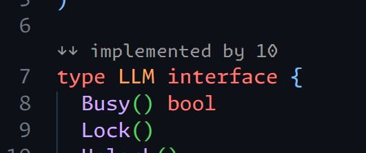||


| Setting | Description | Default |
|---------|-------------|---------|
| `gogoCodeLens.codelens.interface.implementBy.isEnabled` | Enable CodeLens annotations above interfaces to show how many types implement them. | `true` |
| `gogoCodeLens.codelens.interface.implementBy.singularTemplate` | Template text displayed above an interface with exactly one implementation. | `"↓↓ implemented below` |
| `gogoCodeLens.codelens.interface.implementBy.pluralTemplate` | Template text displayed above an interface with multiple implementations. | `↓↓ implemented by {{ count }}` |
| `gogoCodeLens.codelens.interface.implementBy.emptyText` | Text displayed above an interface when no implementations are found. Leave empty to disable the annotation. | *(empty — hides CodeLens)* |

### Child method interface Configuration - `references`

| Enable Only `references` | Enable Both `implementBy` and `references` |
|---------|-------------|
|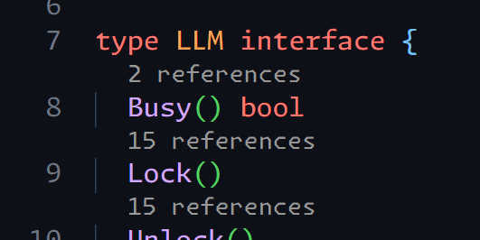|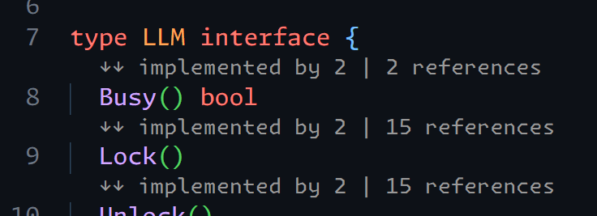|


| Setting | Description | Default |
|---------|-------------|---------|
| `gogoCodeLens.codelens.childMethodInterface.references.isEnabled` | Enable CodeLens annotations above interface methods to show how many times they are referenced. | `true` |
| `gogoCodeLens.codelens.childMethodInterface.references.singularTemplate` | Template text displayed above an interface method with exactly one reference. | `{{ count }} reference` |
| `gogoCodeLens.codelens.childMethodInterface.references.pluralTemplate` | Template text displayed above an interface method with multiple references. | `{{ count }} references` |
| `gogoCodeLens.codelens.childMethodInterface.references.emptyText` | Text displayed above an interface method when no references are found. Leave empty to disable the annotation. | `0 references` |

### Child method interface Configuration - `implementBy`

| Enable Only `implementBy` | Enable Both `implementBy` and `references` |
|---------|-------------|
|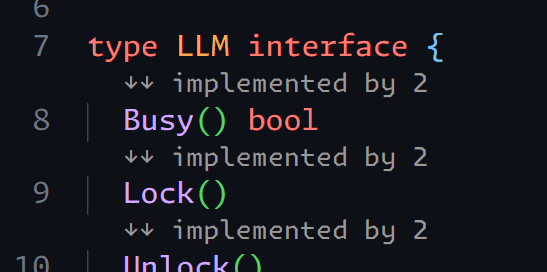||


| Setting | Description | Default |
|---------|-------------|---------|
| `gogoCodeLens.codelens.childMethodInterface.implementBy.isEnabled` | Enable CodeLens annotations above interface methods to show how many types implement them. | `true` |
| `gogoCodeLens.codelens.childMethodInterface.implementBy.singularTemplate` | Template text displayed above an interface method with exactly one implementation. | `↓↓ implemented below` |
| `gogoCodeLens.codelens.childMethodInterface.implementBy.pluralTemplate` | Template text displayed above an interface method with multiple implementations. | `↓↓ implemented by {{ count }}` |
| `gogoCodeLens.codelens.childMethodInterface.implementBy.emptyText` | Text displayed above an interface method when no implementations are found. Leave empty to disable the annotation. | `no implementation` |

### Method Configuration - `references`


| Enable Only `references` | Enable Both `implementFrom` and `references` |
|---------|-------------|
|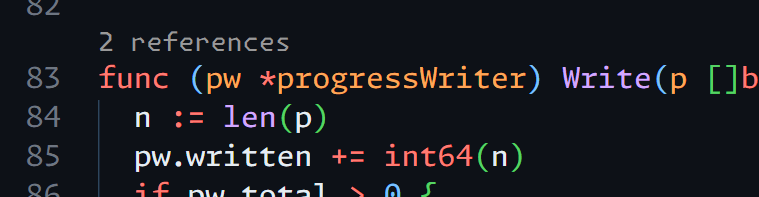||

| Setting | Description | Default |
|---------|-------------|---------|
| `gogoCodeLens.codelens.method.references.isEnabled` | Enable CodeLens annotations above methods to show how many times they are referenced. | `true` |
| `gogoCodeLens.codelens.method.references.singularTemplate` | Template text displayed above a method with exactly one reference. | `{{ count }} reference` |
| `gogoCodeLens.codelens.method.references.pluralTemplate` |  Template text displayed above a method with multiple references. | `"{{ count }} references` |
| `"gogoCodeLens.codelens.method.references.emptyText` | Text displayed above a method when no references are found. Leave empty to disable the annotation. | *(empty — hides CodeLens)* |

### Method Configuration - `implementFrom`

| Enable Only `implementFrom` | Enable Both `implementFrom` and `references` |
|---------|-------------|
|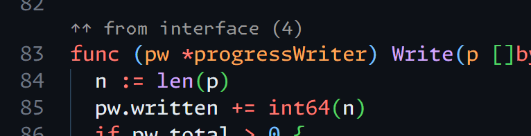||


| Setting | Description | Default |
|---------|-------------|---------|
| `gogoCodeLens.codelens.method.implementFrom.isEnabled` | Enable CodeLens annotations above methods to show how many interface methods they implement. | `true` |
| `gogoCodeLens.codelens.method.implementFrom.singularTemplate` | Template text displayed above a method that implements exactly one interface method. | `↑↑ from interface` |
| `gogoCodeLens.codelens.method.implementFrom.pluralTemplate` | Template text displayed above a method that implements multiple interface methods. | `↑↑ from interface ({{ count }})` |
| `gogoCodeLens.codelens.method.implementFrom.emptyText` | Text displayed above a method that does not implement any interface methods. Leave empty to disable the annotation. | *(empty — hides CodeLens)* |


### Struct Configuration - `references`

| Enable Only `references` | Enable Both `implementFrom` and `references` |
|---------|-------------|
|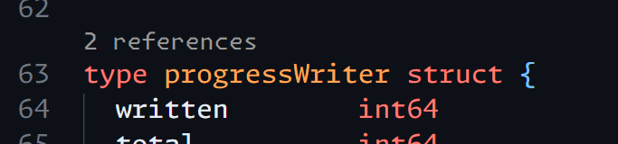||


| Setting | Description | Default |
|---------|-------------|---------|
| `gogoCodeLens.codelens.struct.references.isEnabled` | Enable CodeLens annotations above structs to show how many times they are referenced. | `true` |
| `gogoCodeLens.codelens.struct.references.singularTemplate` | Template text displayed above a struct with exactly one reference. | `{{ count }} reference` |
| `gogoCodeLens.codelens.struct.references.pluralTemplate` | Template text displayed above a struct with multiple references. | `{{ count }} references` |
| `gogoCodeLens.codelens.struct.references.emptyText` | Text displayed above a struct when no references are found. Leave empty to disable the annotation. | *(empty — hides CodeLens)* |

### Struct Configuration - `implementFrom`

| Enable Only `implementFrom` | Enable Both `implementFrom` and `references` |
|---------|-------------|
|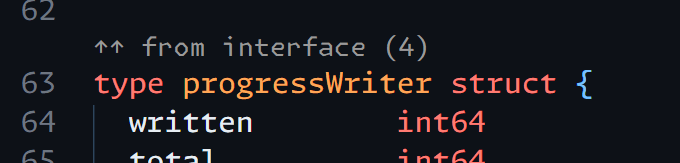||


| Setting | Description | Default |
|---------|-------------|---------|
| `gogoCodeLens.codelens.struct.implementFrom.isEnabled` | Enable CodeLens annotations above structs to show how many interfaces they implement. | `true` |
| `gogoCodeLens.codelens.struct.implementFrom.singularTemplat` | Template text displayed above a struct that implements exactly one interface. | `↑↑ from interface` |
| `gogoCodeLens.codelens.struct.implementFrom.pluralTemplate` | Template text displayed above a struct that implements multiple interfaces. | `↑↑ from interface ({{ count }})` |
| `gogoCodeLens.codelens.struct.implementFrom.emptyText` | Text displayed above a struct that does not implement any interfaces. Leave empty to disable the annotation. | *(empty — hides CodeLens)* |


### Type alias Configuration - `references`

| Enable Only `references` | Enable Both `implementFrom` and `references` |
|---------|-------------|
|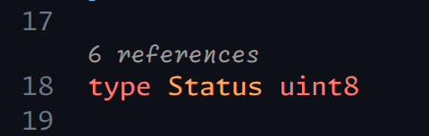||


| Setting | Description | Default |
|---------|-------------|---------|
| `gogoCodeLens.codelens.typeAlias.references.isEnabled` | Enable CodeLens annotations above type aliases to show how many times they are referenced. | `true` |
| `gogoCodeLens.codelens.typeAlias.references.singularTemplate` | Template text displayed above a type alias with exactly one reference. | `{{ count }} reference` |
| `gogoCodeLens.codelens.typeAlias.references.pluralTemplate` | Template text displayed above a type alias with multiple references. | `{{ count }} references` |
| `gogoCodeLens.codelens.typeAlias.references.emptyText` | Text displayed above a type alias when no references are found. Leave empty to disable the annotation. | *(empty — hides CodeLens)* |

### Type alias Configuration - `implementFrom`

| Enable Only `implementFrom` | Enable Both `implementFrom` and `references` |
|---------|-------------|
|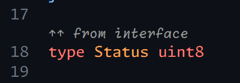||


| Setting | Description | Default |
|---------|-------------|---------|
| `gogoCodeLens.codelens.typeAlias.implementFrom.isEnabled` | Enable CodeLens annotations above type aliases to show how many interfaces they implement. | `true` |
| `gogoCodeLens.codelens.typeAlias.implementFrom.singularTemplat` | Template text displayed above a type alias that implements exactly one interface. | `↑↑ from interface` |
| `gogoCodeLens.codelens.typeAlias.implementFrom.pluralTemplate` | Template text displayed above a type alias that implements multiple interfaces. | `↑↑ from interface ({{ count }})` |
| `gogoCodeLens.codelens.typeAlias.implementFrom.emptyText` | Text displayed above a type alias that does not implement any interfaces. Leave empty to disable the annotation. | *(empty — hides CodeLens)* |


### Constant Configuration - `references`

| Enable Only `references` |
|---------|
||


| Setting | Description | Default |
|---------|-------------|---------|
| `gogoCodeLens.codelens.constant.references.isEnabled` | Enable CodeLens annotations above constants to show how many times they are referenced. | `true` |
| `gogoCodeLens.codelens.constant.references.singularTemplate` | Template text displayed above a constant with exactly one reference. | `{{ count }} reference` |
| `gogoCodeLens.codelens.constant.references.pluralTemplate` | Template text displayed above a constant with multiple references. | `{{ count }} references` |
| `gogoCodeLens.codelens.constant.references.emptyText` | Text displayed above a constant when no references are found. Leave empty to disable the annotation. | *(empty — hides CodeLens)* |


### Variable Configuration - `references`

| Enable Only `references` |
|---------|
||


| Setting | Description | Default |
|---------|-------------|---------|
| `gogoCodeLens.codelens.variable.references.isEnabled` | Enable CodeLens annotations above variables to show how many times they are referenced. | `true` |
| `gogoCodeLens.codelens.variable.references.singularTemplate` | Template text displayed above a variable with exactly one reference. | `{{ count }} reference` |
| `gogoCodeLens.codelens.variable.references.pluralTemplate` | Template text displayed above a variable with multiple references. | `{{ count }} references` |
| `gogoCodeLens.codelens.variable.references.emptyText` | Text displayed above a variable when no references are found. Leave empty to disable the annotation. | *(empty — hides CodeLens)* |

